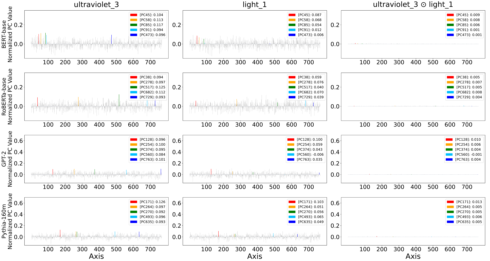

# Appendix

## Appendix A

Tables 4 and 5 can be generated from the output of [src/Table1to3_save_ultraviolet_and_light_pvalues.py](src/Table1to3_save_ultraviolet_and_light_pvalues.py).

## Appendix B

To generate Fig. 10, run:

```bash
$ python src/Appendix_B_Fig10_make_glove_normalization.py
```

<table style="margin: auto; text-align: center;">
  <tr>
    <th style="text-align: center; width: 45%;">(a) Before Normalization</th>
    <th style="text-align: center; width: 45%;">(b) After Normalization</th>
  </tr>
  <tr>
    <td style="text-align: center;">
      
    </td>
    <td style="text-align: center;">
      
    </td>
  </tr>
</table>

## Appendix C

To generate Fig. 11, run:

```bash
$ python src/Appendix_C_Fig11_make_cossim_histogram.py
```

<div align="center">

</div>

Fig. 12 is generated by [src/Fig3_make_normalized_values_histograms.py](src/Fig3_make_normalized_values_histograms.py).

<table style="margin: auto; text-align: center;">
  <tr>
    <th style="text-align: center; width: 33%;">(a) Components</th>
    <th style="text-align: center; width: 33%;">(b) Component-wise products</th>
    <th style="text-align: center; width: 33%;">(c) Component-wise products (magnified)</th>
  </tr>
  <tr>
    <td></td>
    <td></td>
    <td></td>
  </tr>
</table>

Table 6 can be generated from the output of [src/Table1to3_save_ultraviolet_and_light_pvalues.py](src/Table1to3_save_ultraviolet_and_light_pvalues.py).

## Appendix D

Fig. 13 is generated by [src/Fig6_calc_valid_sentences_for_ultraviolet_and_light_bargraphs.py](src/Fig6_calc_valid_sentences_for_ultraviolet_and_light_bargraphs.py).

<div align="center">

</div>

To generate Fig. 14, run:

```bash
$ src/Appendix_D_Fig14_make_ultraviolet_and_light_bargraphs_for_contextualized.py
```

<div align="center">

</div>


Table 9a is generated by [src/Fig6_make_ultraviolet_and_light_bargraphs_for_contextualized.py](src/Fig6_make_ultraviolet_and_light_bargraphs_for_contextualized.py) and Table 9b is generated by [src/Appendix_D_Fig14_make_ultraviolet_and_light_bargraphs_for_contextualized.py](src/Appendix_D_Fig14_make_ultraviolet_and_light_bargraphs_for_contextualized.py).

Tables 10 and 11 can be generated from the output of [src/Table1to3_save_ultraviolet_and_light_pvalues.py](src/Table1to3_save_ultraviolet_and_light_pvalues.py).

To generate Fig. 15, run:

```bash
$ python src/Appendix_D_Fig15_make_contextualized_normalization.py
```

<div style="text-align: center;">
<table>
  <tr>
    <th colspan="2" style="text-align:center;">(a) Before Normalization</th>
  </tr>
  <tr>
    <td></td>
  </tr>
</table>
<table>
  <tr>
    <th colspan="2" style="text-align:center;">(b) After Normalization</th>
  </tr>
  <tr>
    <td></td>
  </tr>
</table>
</div>

To generate Fig. 16, run:

```bash
$ python src/Appendix_D_Fig16_make_component_comparison_for_ica_and_pca.py
```

<div style="text-align: center;">
<table>
  <tr>
    <th colspan="2" style="text-align:center;">(a) Sorted along embeddings</th>
  </tr>
  <tr>
    <td></td>
  </tr>
</table>
<table>
  <tr>
    <th colspan="2" style="text-align:center;">(b) Sorted along axes</th>
  </tr>
  <tr>
    <td></td>
  </tr>
</table>
</div>

## Appendix F

Table 12 can be generated from [src/Fig9a_eval_wordsim.py](src/Fig9a_eval_wordsim.py) and [src/Fig9b_eval_analogy.py](src/Fig9b_eval_analogy.py).

Precomputed results are also available in [output/evaluation](output/evaluation).

To generate Figs. 17 and 18, run:

```bash
$ python src/Appendix_F_Figs17_18_make_correration_with_cossim.py
```

<table style="margin: auto; text-align: center;">
  <tr>
    <th style="text-align: center; width: 33%;">(a) p = 1</th>
    <th style="text-align: center; width: 33%;">(b) p = 10</th>
    <th style="text-align: center; width: 33%;">(c) p = 100</th>
  </tr>
  <tr>
    <td></td>
    <td></td>
    <td></td>
  </tr>
</table>

<div align="center">

</div>

## Appendix G

To generate Fig. 19, run:

```bash
$ python src/Appendix_G_Fig19_make_plot_for_food_animals_plants.py
```

<div align="center">

</div>

## Appendix H

To generate Table 13, run:

```bash
$ python src/Appendix_H_Table13_make_top10_words.py
```

To generate Fig. 20, run:

```bash
$ python src/Appendix_H_Fig20_make_woman_girl_man_bargraphs.py
```

<div align="center">

</div>

To generate Fig. 21, run:

```bash
$ python src/Appendix_H_Fig21_make_plots_for_comparing_embeddings.py 
```

<table style="margin: auto; text-align: center;">
  <tr>
    <th style="text-align: center; width: 45%;">(a) woman and girl</th>
    <th style="text-align: center; width: 45%;">(b) woman and man</th>
  </tr>
  <tr>
    <td style="text-align: center;">
      
    </td>
    <td style="text-align: center;">
      
    </td>
  </tr>
</table>

To generate Fig. 22, run:

```bash
$ python src/Appendix_H_Fig22_make_plot_for_comparing_similarity.py
```

<div align="center">

</div>

## Appendix I

### Appendix I.1

From the original repository [shimo-lab/Universal-Geometry-with-ICA](https://github.com/shimo-lab/Universal-Geometry-with-ICA/tree/main/universal#pca-and-ica-transformation-1), download the ICA-transformed BERT embeddings and place them in `data/embeddings/Universal-Geometry-with-ICA/bert-pca-ica-100000.pkl`.

To generate Fig. 23, run:

```bash
$ python src/Appendix_I1_Fig23_make_shore_bargraphs.py 
```

<div align="center">

</div>

Tables 14 are also generated.

### Appendix I.2

Following the instructions in the original repository [shimo-lab/Universal-Geometry-with-ICA](https://github.com/shimo-lab/Universal-Geometry-with-ICA/tree/main/universal#cross-lingual-embeddings), download the ICA-transformed and PCA-transformed fastText embeddings for multiple languages, as well as the fonts, and place them as follows:

```bash
data
└── embeddings
    └── Universal-Geometry-with-ICA
        ├── en-es-ru-ar-hi-zh-ja
        │   ├── axis_matching_ica.pkl
        │   └── axis_matching_pca.pkl
        └── fonts
            ├── NotoSansCJKjp-Regular.otf
            └── NotoSansDevanagari-VariableFont_wdth,wght.ttf
```

To generate Figs. 24 and 25, run:

```bash
$ python src/Appendix_I2_Fig24_25_make_boat_bargraphs.py
```

<table style="margin: auto; text-align: center;">
  <tr>
    <th style="text-align: center; width: 45%;">(a) English</th>
    <th style="text-align: center; width: 45%;">(b) Spanish</th>
  </tr>
  <tr>
    <td style="text-align: center;">
      
    </td>
    <td style="text-align: center;">
      
    </td>
  </tr>
</table>

Table 16 is also generated.