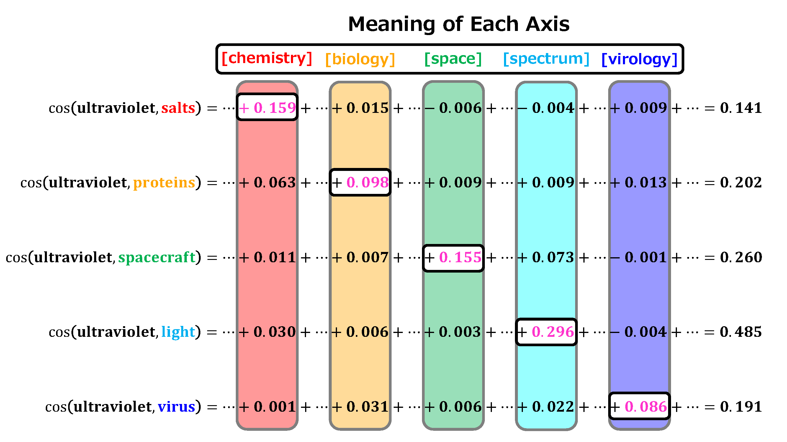

# Cosine-Similarity-via-ICA

> [Revisiting Cosine Similarity via Normalized ICA-transformed Embeddings](https://arxiv.org/abs/2406.10984)                 
> [Hiroaki Yamagiwa](https://ymgw55.github.io/), [Momose Oyama](https://momoseoyama.github.io/), [Hidetoshi Shimodaira](http://stat.sys.i.kyoto-u.ac.jp/members/shimo/)          
> *Preprint*



# Code
The source code is being organized and will be available soon. 

# Reference

- Yamagiwa et al. Discovering Universal Geometry in Embeddings with ICA. EMNLP. 2023.

# Citation
If you find our code or model useful in your research, please cite our paper:
```
@misc{yamagiwa2024revisitingcosinesimilaritynormalized,
      title={Revisiting Cosine Similarity via Normalized ICA-transformed Embeddings}, 
      author={Hiroaki Yamagiwa and Momose Oyama and Hidetoshi Shimodaira},
      year={2024},
      eprint={2406.10984},
      archivePrefix={arXiv},
      primaryClass={cs.CL},
      url={https://arxiv.org/abs/2406.10984}, 
}
```