# Cosine-Similarity-via-ICA

> [Revisiting Cosine Similarity via Normalized ICA-transformed Embeddings](https://aclanthology.org/2025.coling-main.497/)                 
> [Hiroaki Yamagiwa](https://ymgw55.github.io/), [Momose Oyama](https://momoseoyama.github.io/), [Hidetoshi Shimodaira](http://stat.sys.i.kyoto-u.ac.jp/members/shimo/)          
> *COLING 2025*

<div align="center">
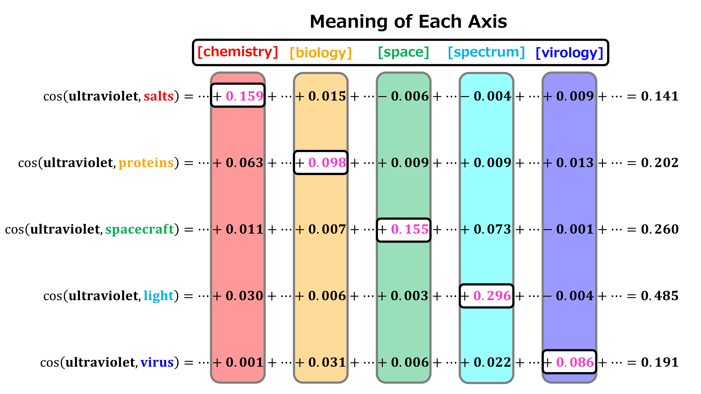
</div>

## Setup

This repository is intended to be run in a Docker environment. If you are not familiar with Docker, please install the packages listed in [requirements.txt](requirements.txt).

### Docker build

Create a Docker image as follows:

```bash
$ bash scripts/docker/build.sh
```

### Environment variable

Set the `DOCKER_HOME` environment variable to specify the path of the directory to be mounted as the home directory inside the Docker container.

```bash
$ export DOCKER_HOME="path/to/your/docker_home"
```

### Docker run

Run the Docker container by passing the GPU ID as an argument:

```bash
$ bash scripts/docker/run.sh 0
```

## Code

### Save GloVe embeddings

#### Using preprocessed data from the experiments

Instead of recomputing the embeddings, you can access the embeddings used in the paper through the following links. Note that sign flip was not applied to the ICA-transformed embeddings to ensure that the skewness of the axes remains positive.

Original, PCA-transformed and ICA-transformed embeddings (Google Drive):

- [GloVe](https://drive.google.com/file/d/1ZXlcptNFt0VHg9EgGmAe1P_1V2OWS80b/view?usp=drive_link)

Place the file as follows:

```bash
output
└── embeddings
    └── glove_dic_and_emb.pkl
```

#### For reproducibility (in necessary)

Download GloVe embeddings as follows:

```bash
$ mkdir -p data/embeddings
$ wget https://nlp.stanford.edu/data/glove.6B.zip
$ unzip glove.6B.zip -d data/embeddings/glove.6B
```

For more details, please refer to the original repository: [stanfordnlp/GloVe](https://github.com/stanfordnlp/GloVe).

To compute the PCA-transformed and ICA-transformed embeddings:

```bash
$ python src/save_glove_pca_ica_embeddings.py 
```

### Save contextualized embeddings

#### Using preprocessed data from the experiments

Instead of recomputing the embeddings, you can access the embeddings used in the paper through the following links. Note that sign flip was not applied to the ICA-transformed embeddings to ensure that the skewness of the axes remains positive.

Original, PCA-transformed and ICA-transformed embeddings (Google Drive):

- [bert-base-uncased](https://drive.google.com/file/d/12hKedTIrINmtjiZ5oAQlU7rIhyp6_3XN/view?usp=drive_link)
- [roberta-base](https://drive.google.com/file/d/1mS07IS5jfIaJOuIAVy4FbCxLM7s5724Q/view?usp=drive_link)
- [gpt2](https://drive.google.com/file/d/1QT7TxlB3u38vSvNY-akvx2bTc-6RoOks/view?usp=drive_link)
- [EleutherAI/pythia-160m](https://drive.google.com/file/d/1FK3MISLXSOfF2iknUib7Fj9qf6jK8JhQ/view?usp=drive_link)

Place them as follows:

```bash
output
└── embeddings
    ├── EleutherAI-pythia-160m_dic_and_emb.pkl
    ├── bert-base-uncased_dic_and_emb.pkl
    ├── gpt2_dic_and_emb.pkl
    └── roberta-base_dic_and_emb.pkl
```

#### For reproducibility (in necessary)

Download One Billion Word Benchmark [3] from the link [https://www.statmt.org/lm-benchmark/](https://www.statmt.org/lm-benchmark/).

Place it as follows. For embedding computations, we use `news.en-00001-of-00100`.

```bash
data
└── 1-billion-word-language-modeling-benchmark-r13output
    └── training-monolingual.tokenized.shuffled
        ├── news.en-00001-of-00100
        ...
```

We prioritize sentences containing "ultraviolet" for embedding computations:

```bash
$ python src/save_contextualized_embeddings.py
```

To compute the PCA-transformed and ICA-transformed embeddings:

```bash
$ python src/save_contextualized_pca_ica_embeddings.py --model_name bert-base-uncased
$ python src/save_contextualized_pca_ica_embeddings.py --model_name roberta-base
$ python src/save_contextualized_pca_ica_embeddings.py --model_name gpt2
$ python src/save_contextualized_pca_ica_embeddings.py --model_name EleutherAI/pythia-160m
```

### Fig. 1: Heatmap

```bash
$ python src/Fig1_make_heatmap_comparing_ica_with_pca.py
```

<div align="center">
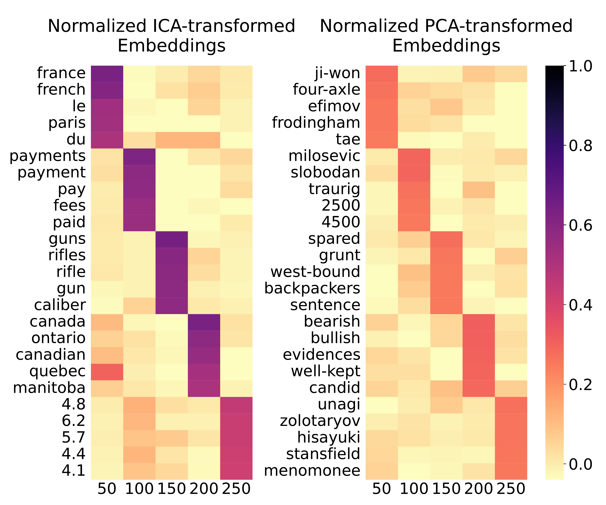
</div>

### Fig. 2: Bar graph for "ultraviolet" and "light" using GloVe embeddings

```bash
$ python src/Fig2_make_ultraviolet_and_light_bargraphs.py
```

<div style="text-align: center;">
<table>
  <tr>
    <th colspan="2" style="text-align:center;">Normalized ICA-transformed GloVe embeddings</th>
  </tr>
  <tr>
    <td>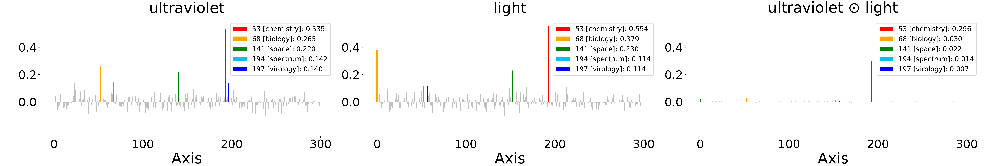</td>
  </tr>
</table>
<table>
  <tr>
    <th colspan="2" style="text-align:center;">Normalized PCA-transformed GloVe embeddings</th>
  </tr>
  <tr>
    <td>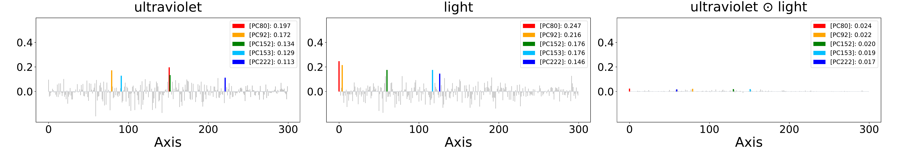</td>
  </tr>
</table>
</div>

### Fig. 3: Histograms of component values and their component-wise products

```bash
$ python src/Fig3_make_normalized_values_histograms.py
```

<table style="margin: auto; text-align: center;">
  <tr>
    <th style="text-align: center; width: 33%;">(a) Components</th>
    <th style="text-align: center; width: 33%;">(b) Component-wise products</th>
    <th style="text-align: center; width: 33%;">(c) Component-wise products (magnified)</th>
  </tr>
  <tr>
    <td>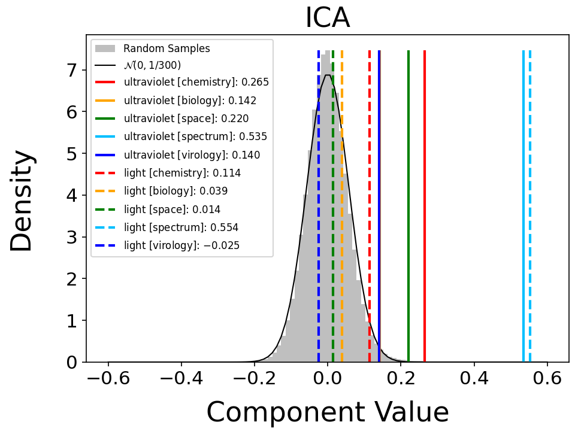</td>
    <td>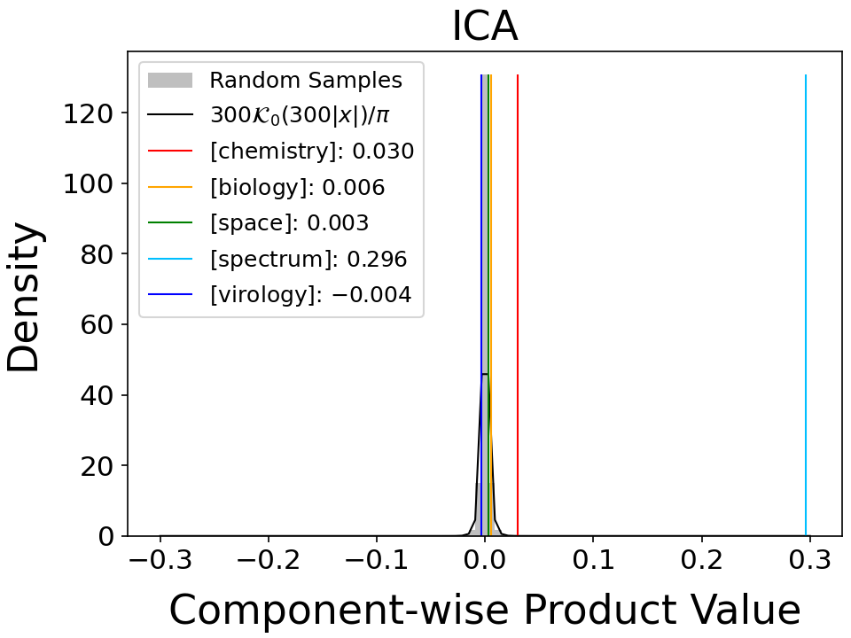</td>
    <td>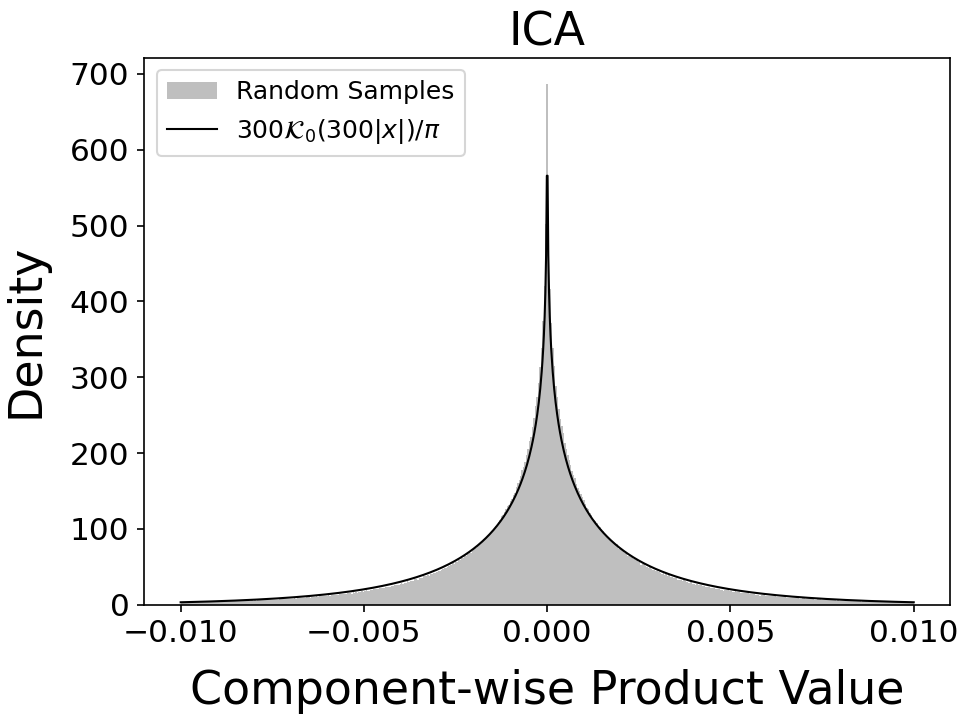</td>
  </tr>
</table>

(Fig. 12 for PCA is also generated.)

### Fig. 4: Display of values

```bash
$ python src/Fig4_show_products.py
         word 53 [chemistry] 68 [biology] 141 [space] 194 [spectrum] 197 [virology] cossim with ultraviolet
0       salts          0.159        0.015      -0.006         -0.004          0.009                  0.141
1    proteins          0.063        0.098       0.009          0.009          0.013                  0.202
2  spacecraft          0.011        0.007       0.155          0.073         -0.001                  0.260
3       light          0.030        0.006       0.003          0.296         -0.004                  0.485
4       virus          0.001        0.031       0.006          0.022          0.086                  0.191
```

🚨 If you run experiments with different settings, please rename the axis labels accordingly.

### Fig. 5: Consistency of ICA across GloVe and contextualized embedding models

Axis matching:

```bash
$ python src/Fig5_calc_axis_matching_for_GloVe_and_contextualzed.py 
```

Heatmap creation:

```bash
$ python src/Fig5_make_heatmap_for_GloVe_and_contextualzed.py 
```

<div style="text-align: center;">
<table>
  <tr>
    <th colspan="2" style="text-align:center;">Normalized ICA-transformed embeddings</th>
  </tr>
  <tr>
    <td>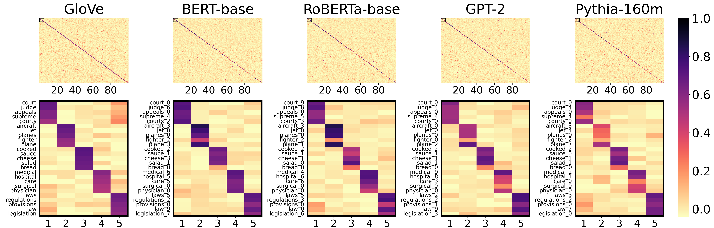</td>
  </tr>
</table>
<table>
  <tr>
    <th colspan="2" style="text-align:center;">Normalized PCA-transformed embeddings</th>
  </tr>
  <tr>
    <td>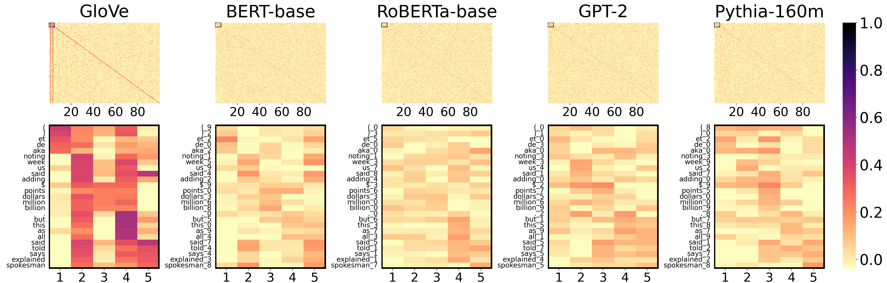</td>
  </tr>
</table>
</div>

### Fig. 6: Bar graph for "ultraviolet" and "light" using GPT-2 and Pythia-160m embeddings

Because tokenization differs for each model, we first search for valid sentences containing “ultraviolet” and “light”:

```bash
$ python src/Fig6_calc_valid_sentences_for_ultraviolet_and_light_bargraphs.py
```

🚨 This code ensures that the final embeddings for “ultraviolet” and “light” come from the same sentence across four models, but it does not rigorously handle corner cases where a single sentence might contain multiple occurrences of “ultraviolet” and “light.”

Generate the bar graphs:

```bash
$ python src/Fig6_make_ultraviolet_and_light_bargraphs_for_contextualized.py 
```

<div align="center">
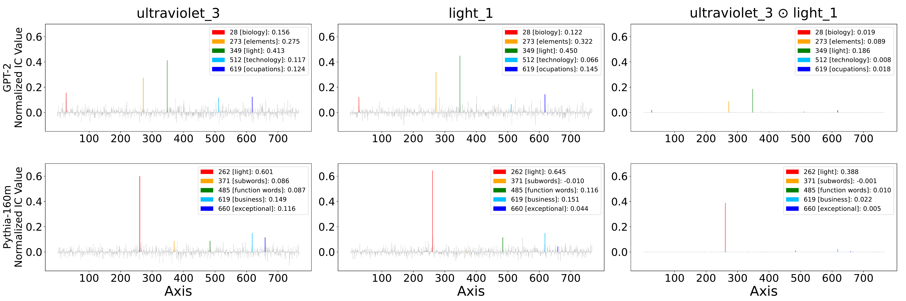
</div>

### Fig. 7: Word intrusion task

Initializing the `Intruder` class takes about one hour, so you can use a pre-initialized file:

- [intruder_5.pkl (Google Drive)](https://drive.google.com/file/d/19diwFQ7X3dpD8Cth21ZMgX2v5OqU8iV2/view?usp=drive_link)

Place it in `data/word_intruder_task/intruder_5.pkl`.

Then run `src/Fig7_make_intruder_bargraph.ipynb` (verified on VSCode).

<div align="center">
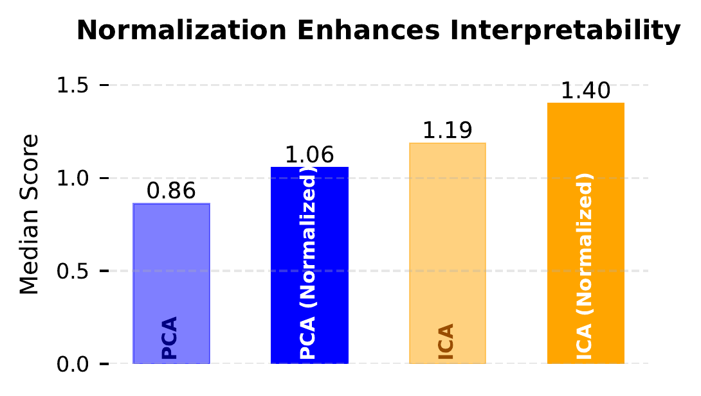
</div>

### Fig. 8: Comparing component values for ICA and PCA

```bash
$ python src/Fig8_make_component_comparison_for_ica_and_pca.py
```

<table style="margin: auto; text-align: center;">
  <tr>
    <th style="text-align: center; width: 35%;">(a) Sorted along embeddings</th>
    <th style="text-align: center; width: 35%;">(b) Sorted along axes</th>
  </tr>
  <tr>
    <td style="text-align: center;">
      
    </td>
    <td style="text-align: center;">
      
    </td>
  </tr>
</table>

### Fig. 9: Sparsity of component-wise products

#### Using the experiment results directly

The analogy task takes significant time; precomputed results are available under [output/evaluation](output/evaluation).

#### For reproducibility (in necessary)

For the word similarity task, we modified the repository [word-embeddings-benchmarks](https://github.com/kudkudak/word-embeddings-benchmarks) [4]. Install it via:

```bash
$ cd src/word-embeddings-benchmarks
$ pip install -e .
$ cd ../..
```

Evaluate word similarity:

```bash
$ python src/Fig9a_eval_wordsim.py
```

Evaluate analogy:

```bash
# These are not optimized for speed and may each take about two days to run.
$ python src/Fig9b_eval_analogy.py --emb_type ica --task_name Google
$ python src/Fig9b_eval_analogy.py --emb_type ica --task_name Google
$ python src/Fig9b_eval_analogy.py --emb_type pca --task_name MSR
$ python src/Fig9b_eval_analogy.py --emb_type pca --task_name MSR
```

#### Fig. 9 plots

```bash
$ python src/Fig9_make_plots_for_wordsim_and_analogy.py
```

<div align="center">
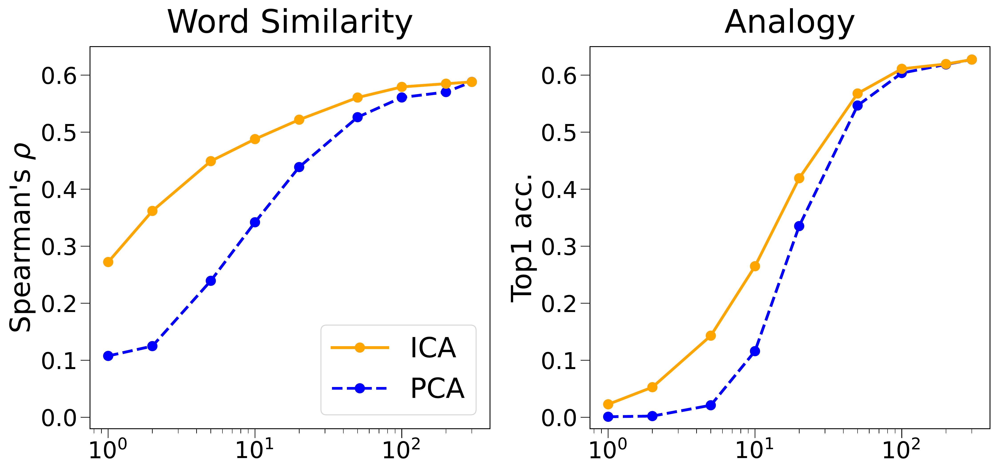
</div>

### Statistical analysis of axis selection

#### Using the experiment results directly

For reproducibility related to Fig. 2 (GloVe) and Fig. 6 (GPT-2, Pythia-160m), the outputs from `src/Table1to3_make_ultraviolet_and_light_embeddings_csv.py` are available at [output/ultraviolet_and_light](output/ultraviolet_and_light).

The $p$-value results from Mathematica are in [data/ultraviolet_and_light_pvalues](data/ultraviolet_and_light_pvalues).

#### For reproducibility (in necessary)

Configure your environment to reproduce Fig. 2 (for GloVe) or Fig. 6 (for GPT-2, Pythia-160m).

We save information about the embeddings for “ultraviolet” and “light” and create CSV files for the statistical tests used in the paper:

```bash
$ python src/Table1to3_make_ultraviolet_and_light_embeddings_csv.py
```

For the Mathematica scripts used to compute $p$-values, see [src/mathematica](src/mathematica).

#### Saving the values for Tables 1, 2, and 3

```bash
python src/Table1to3_save_ultraviolet_and_light_pvalues.py
```

## References

[1] Yamagiwa et al. Discovering Universal Geometry in Embeddings with ICA. EMNLP. 2023.

[2] Yamagiwa et al. Axis Tour: Word Tour Determines the Order of Axes in ICA-transformed Embeddings. EMNLP. 2024 Findings.

[3] Chelba et al. One billion word benchmark for measuring progress in statistical language modeling. INTER-SPEECH. 2014.

[4] Jastrzebski et al. How to evaluate word embeddings? On importance of data efficiency and simple supervised tasks. arXiv. 2017.

[5] Musil et al. Exploring Interpretability of Independent Components of Word Embeddings with Automated Word Intruder Test. COLING 2024.

## Citation

If you find our code or model useful in your research, please cite our paper:

```
@inproceedings{yamagiwa-etal-2025-revisiting,
    title = "Revisiting Cosine Similarity via Normalized {ICA}-transformed Embeddings",
    author = "Yamagiwa, Hiroaki  and
      Oyama, Momose  and
      Shimodaira, Hidetoshi",
    editor = "Rambow, Owen  and
      Wanner, Leo  and
      Apidianaki, Marianna  and
      Al-Khalifa, Hend  and
      Eugenio, Barbara Di  and
      Schockaert, Steven",
    booktitle = "Proceedings of the 31st International Conference on Computational Linguistics",
    month = jan,
    year = "2025",
    address = "Abu Dhabi, UAE",
    publisher = "Association for Computational Linguistics",
    url = "https://aclanthology.org/2025.coling-main.497/",
    pages = "7423--7452",
    abstract = "Cosine similarity is widely used to measure the similarity between two embeddings, while interpretations based on angle and correlation coefficient are common. In this study, we focus on the interpretable axes of embeddings transformed by Independent Component Analysis (ICA), and propose a novel interpretation of cosine similarity as the sum of semantic similarities over axes. The normalized ICA-transformed embeddings exhibit sparsity, enhancing the interpretability of each axis, and the semantic similarity defined by the product of the components represents the shared meaning between the two embeddings along each axis. The effectiveness of this approach is demonstrated through intuitive numerical examples and thorough numerical experiments. By deriving the probability distributions that govern each component and the product of components, we propose a method for selecting statistically significant axes."
}
```

## Appendix

See [README.Appendix.md](README.Appendix.md) for the experiments in the Appendix.

## Note

- Since the URLs of published embeddings may change, please refer to the GitHub repository URL instead of the direct URL when referencing in papers, etc.
- This directory was created by [Hiroaki Yamagiwa](https://ymgw55.github.io/).
- The code for the word intrusion task was created by [Momose Oyama](https://momoseoyama.github.io/).
- The mathematica code for $p$-values was created by [Hidetoshi Shimodaira](http://stat.sys.i.kyoto-u.ac.jp/members/shimo/).